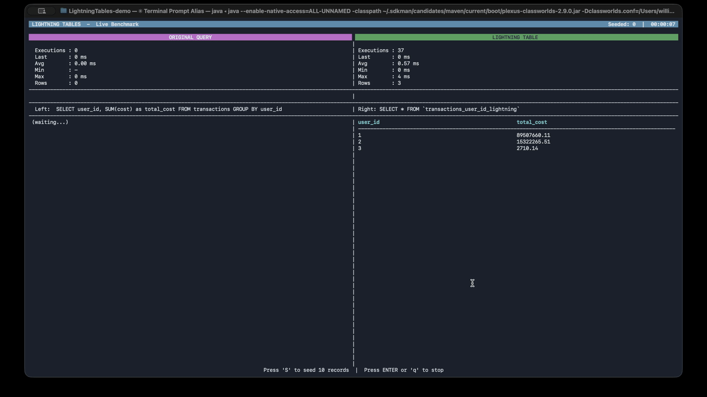

> **⚠️ ALPHA WARNING**
> This is a very early alpha product under active development. Expect rapid changes, incomplete features, and potential breaking changes. Not recommended for production use at this time.

---

# ⚡ LightningTables (aka the summary slayer)

**Kill summary tables. Get instant, always-up-to-date results.**

LightningTables is a **materialized view engine for MariaDB** that turns a single query into a fully managed, incrementally updated summary table.

You provide the query.
LightningTables generates the triggers, keeps the data in sync, and guarantees fast reads—automatically.

---

## 🚀 What LightningTables Does

- Takes a query and **creates a materialized summary table**
- Automatically generates the **trigger code** required to keep it updated
- Applies **incremental updates** on INSERT, UPDATE, and DELETE
- Ensures the summary is **always current**
- Provides **extremely fast read performance**

No cron jobs.  
No rebuilds.  
No stale data.

---

## ❌ The Problem with Summary Tables

Traditional summary tables are:

- Fragile and easy to break during crashes or bugs
- Hard to keep in sync with live data
- Prone to falling behind under heavy write load
- A constant maintenance burden

When they fail, they fail silently—and your data becomes wrong.

---

## ✅ The LightningTables Approach

LightningTables replaces manual summary tables with **incrementally maintained materialized views**.

- Updates happen **at write time**
- Data is **always correct**
- No lag, no rebuild windows
- No application-level sync logic

If the write succeeds, the summary updates. Period.

---

## ⚙️ Core Requirements

### `updated_at` Is Mandatory

To create a summary table, the base table **must** contain:

- An `updated_at` column
- The column must represent the **last modification time of the row**

This field is foundational to LightningTables’s correctness and locking strategy.

---

## 🧠 How LightningTables Works Internally

Creating a summary table while live traffic is ongoing is the hard problem.  
LightningTables solves this with **minimal locking**, **transactional correctness**, and **guaranteed backfill accuracy**.

---

### 🔒 Step 1: Acquire a Minimal Write Lock

When creating a new summary table, LightningTables briefly acquires a **small write lock** on the base table.

During this lock, it performs exactly two operations:

1. **Capture the high-water mark**
   - Records the current timestamp (`lock_timestamp`)
   - This timestamp guarantees **backfill accuracy**
2. **Generate and apply trigger code**
   - INSERT / UPDATE / DELETE triggers are created and activated

The lock exists only long enough to guarantee a clean handoff.

---

### ⚡ Step 2: Release Lock & Enable Live Updates

Once the triggers are active:

- The write lock is released immediately
- New writes continue without interruption
- All new changes are **incrementally applied** to the summary table

From this point forward, the summary table is **live and correct**.

---

### 🔄 Step 3: Backfill Historical Data (Safely)

With triggers handling new writes, LightningTables begins backfilling older data **based on the captured timestamp**:

- Only rows where `updated_at <= lock_timestamp` are included in the backfill
- Data is processed **in batches**
- Each batch updates the summary table incrementally
- No race conditions are possible

Because the trigger system is already active, **all new writes after the lock are automatically applied**, guaranteeing **100% accuracy**.

---

### 📊 Step 4: Progress Tracking

Since backfill runs in controlled batches:

- Progress can be measured precisely
- Completion percentage is accurate
- You always know when the summary is fully synced

When backfill completes, the summary table is:

- 100% accurate
- Fully synchronized
- Continuously maintained going forward

---

## 🕒 Timeline Diagram

    Time ─────────────────────────────────────────────────────────▶

    [ Acquire Write Lock ]
            |
            |-- Capture current timestamp (lock_timestamp)
            |-- Create & enable triggers
            |
    [ Release Lock ]

                             ┌──────────────────────────┐
                             │ Live writes keep coming   │
                             │ Triggers update summary   │
                             └──────────────────────────┘
                                    ▲
                                    │
                    ┌────────────────────────────────────┐
                    │ Backfill historical data in batches │
                    │ Only rows where updated_at <= timestamp │
                    └────────────────────────────────────┘

    Result:
    ✔ Summary table is correct
    ✔ No downtime
    ✔ No rebuild window
    ✔ No data drift

---

## ❓ Why Triggers, Not Cron Jobs?

Cron-based refresh systems rebuild summary tables on a schedule. That approach introduces serious problems.

### 🚫 Problems with Cron Jobs

- **Data staleness** – data is only correct after the next run
- **Rebuild overhead** – full refreshes get slower as data grows
- **Failure windows** – missed runs silently corrupt accuracy
- **Lag under load** – heavy writes cause refresh backlogs
- **Complex recovery** – failures require manual resyncs

Cron jobs optimize *when* data updates—not *how*.

---

### ✅ Why Triggers Work Better

LightningTables uses **database triggers** to apply **incremental updates at write time**.

- Updates are immediate
- No rebuilds
- No lag
- No drift

If a row changes, the summary changes in the same transaction.

---

### 🔒 Transactional Safety

Triggers run inside the same transaction as the write:

- Write succeeds → summary updates
- Write fails → nothing changes

Partial or inconsistent state is impossible.

---

### ⚡ Performance by Design

Triggers update **only what changed**.

- One insert → one aggregate update
- One delete → one subtraction
- One update → one delta adjustment

This keeps performance predictable—even at scale.

---

## 🧠 Why It Matters

- **Instant access** to complex aggregates
- **Always-up-to-date data**
- **No operational overhead**
- **Predictable performance**

This is the performance of summary tables—without the risk.

---

## ❓ FAQ

### Will triggers slow down writes?
Triggers add a small, predictable cost to writes, but this is usually outweighed by:

- Eliminating expensive read-time aggregations
- Removing full-table refresh jobs
- Avoiding cache invalidation layers

In most systems, **overall throughput improves**.

---

### What happens if the database crashes?
Nothing breaks.

Triggers are transactional:
- Either both the write and summary update commit
- Or neither does

There is no partial state to recover.

---

### Can summaries fall behind?
No.

Updates happen synchronously with writes.  
If the data exists, the summary is correct.

---

### Does this replace MariaDB’s built-in views?
Yes—and more.

Standard views are recomputed at query time.  
LightningTables summaries are **precomputed and incrementally maintained**.

---

### What kinds of queries are supported?
Ideal candidates include:

- Aggregations (`COUNT`, `SUM`, `AVG`)
- `GROUP BY` queries

Support will expand as the engine evolves.

---

### Can I rebuild a summary if needed?
Yes.

LightningTables can:

- Rebuild summaries from scratch
- Validate correctness
- Resume incremental updates afterward

This is intended for rare recovery or schema changes—not daily operation.

---

### Is this safe for production use?
The architecture is database-native and proven.

The project itself is **early-stage**, so production use should be approached carefully until the engine stabilizes.

---

## 🎯 Ideal Use Cases

- Dashboards and analytics
- Counters and statistics
- Financial summaries
- Leaderboards
- High-read, high-write systems

---

## ⚠️ Status

**Early development**

Expect rapid iteration and breaking changes.

---

## 📜 Philosophy

> *If data changes, derived data should update immediately.*

LightningTables exists to make correctness and performance the default—not an ongoing maintenance task.

---

## 🗡️ Final Word

If you’re still maintaining summary tables by hand…

**LightningTables is built to replace them.**
